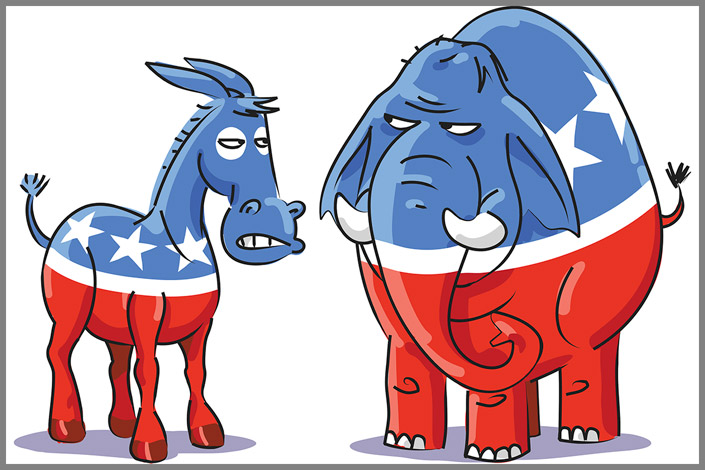

# Applied Data Science @ Columbia
## Spring 2021
### Project 1: What role has partisanship is U.S. elections?



### [Project Description](doc/)

Term: Spring 2021

+ Project title: What role has partisanship in the U.S. elections?
+ This project is conducted by [Aurore Gosmant - apg2170]

+ Project summary: From the very start of Donald Trump’s presidency, Americans have been divided along partisan lines in their views of him. Donald Trump’s victory over Hillary Clinton for president is the first time since 1940 that a major political party’s candidate had previously held no elected office or high-ranking governmental position. Moreover, in early 2020, an unprecedented pandemic stroke on the United States, causing more than 400,000 deaths of Americans, the House of Representatives impeached the 45th president of the United States, the shocking shooting of George Floyd Minneapolis by policemen started the Blacks Live Matter movement, and during the past months, America has been bind to the US elections, for which mail-in ballots counting has been at the heart of one of the greatest controversies. 2020 has been a very difficult year for the American public, and the term “Partisanship” has flourished, hitting the headlines even more every day.  

In this report, I will try to understand what role plays partisanship in American politics today. How does partisanship affect today’s politics, and what role does it play in the US elections? These are the questions I will try to answer through this study.

Following [suggestions](http://nicercode.github.io/blog/2013-04-05-projects/) by [RICH FITZJOHN](http://nicercode.github.io/about/#Team) (@richfitz). This folder is orgarnized as follows.

```
proj/
├── lib/
├── data/
├── doc/
├── figs/
└── output/
```

Please see each subfolder for a README file.
